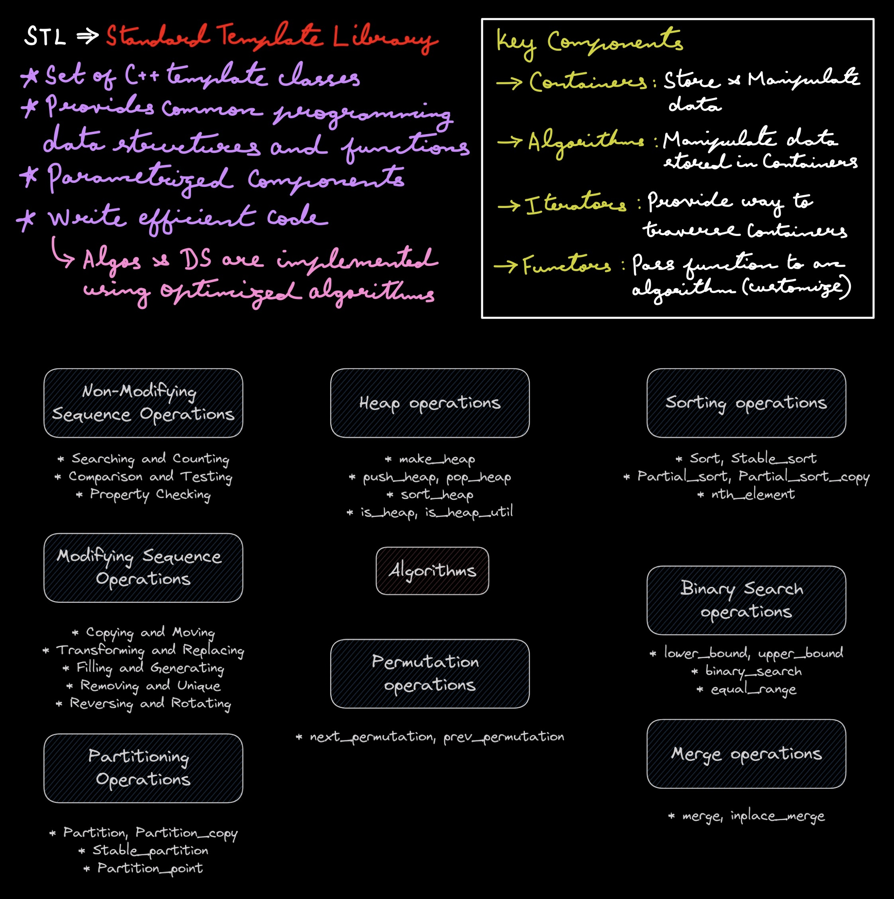
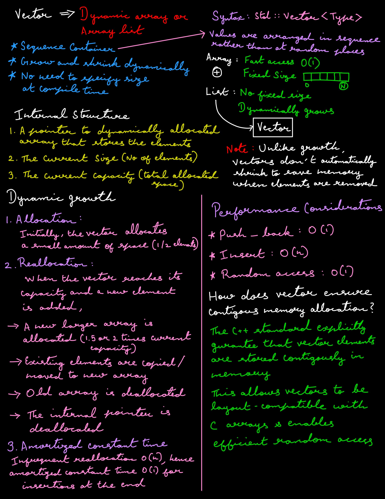

# STL

## Introduction




## Vector




```c++
// Empty vector
std::vector<int> vec1;

// Vector with initial size
std::vector<int> vec2(5);

// Vector with initial size and value
std::vector<int> vec3(5, 10);

// Vector initialized with list
std::vector<int> vec4 = {1, 2, 3, 4, 5};
```


```c++

```
